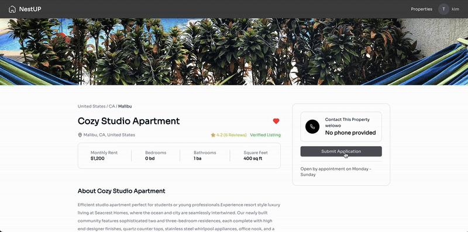

# NestUp 

> #### Begin Your Path to find the perfect place to call home           
>
>   Fun fact: `"NestUP"` is also a play "Next Stop!".

- [NestUp ](#nestup-)
  - [Developed with  and](#developed-with--and)
  - [Features](#features)
      - [`Website Overview`](#website-overview)
      - [`SignUp and SignIn function`](#signup-and-signin-function)
    - [For Managers](#for-managers)
      - [`Manage property listings`](#manage-property-listings)
      - [`Add new property`](#add-new-property)
      - [`Check on applications & Tenant management`](#check-on-applications--tenant-management)
    - [For Tenants](#for-tenants)
      - [`Search your ideal home`](#search-your-ideal-home)
      - [`Apply for rental`](#apply-for-rental)
      - [`Track application status`](#track-application-status)
      - [`Check property detail and save favorite`](#check-property-detail-and-save-favorite)
  - [Contact](#contact)

## Developed with  and

- Front-End
  - Next.js / Typescript
  - Next Navigation
  - Redux / Redux-Toolkit
  - Tailwind CSS
  - Mapbox
  - React-Hook-Form / Zod
- Back-End
  - PostgreSQL
  - Node.js
  - Express
  - Prisma
- AWS Cloud Service
  - EC2
  - RDS
  - Amplify
  - Cognito
  - S3 Bucket
  - API Gateway
- Other
  - Tool: ESLint / Prettier
  - Version Control: Git / GitHub

## Features

#### `Website Overview`
- Clean and intuitive UI with smooth animations for a seamless experience.
 

#### `SignUp and SignIn function`
- Users can sign up and sign in, choosing to register as a manager or tenant.
 

### For Managers

#### `Manage property listings`
- Manage property listings with detailed descriptions and images.
 

#### `Add new property`
- Easily add a property with multiple options and upload images.
 

#### `Check on applications & Tenant management`
- Approve or reject tenant applications.
- View and manage tenant details in one place.
 

---

### For Tenants

#### `Search your ideal home`
Find and explore available properties with filters for price, location, and amenities.
 

#### `Apply for rental`
- Submit rental applications.
 

#### `Track application status`
- Track application status in real-time.
 

#### `Check property detail and save favorite`
- Click the heart icon to save favorite listings and revisit them later.
 

## Contact

Feel free to contact if you have any suggestions!
 
Weiwei WANG / wutamy77@gmail.com

